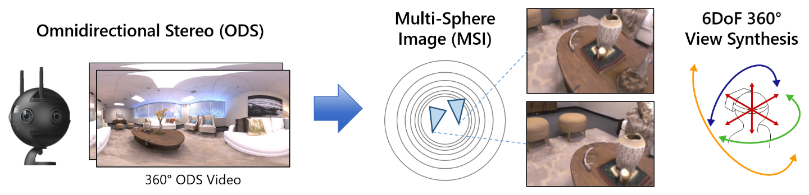

# MatryODShka: Real-time 6DoF Video View Synthesis using Multi-Sphere Images

Codes for the following paper:

MatryODShka: Real-time 6DoF Video View Synthesis using Multi-Sphere Images  
[Benjamin Attal](https://www.battal.me/), [Selena Ling](https://www.selenaling.com/), [Aaron Gokaslan](https://skylion007.github.io/), [Christian Richardt](https://richardt.name/), [James Tompkin](www.jamestompkin.com)  
ECCV 2020

See more at our [project page](http://visual.cs.brown.edu/matryodshka).

If you use these codes, please cite:

    @inproceedings{Attal:2020:ECCV,
        author    = "Benjamin Attal and Selena Ling and Aaron Gokaslan and Christian Richardt and James Tompkin",
        title     = "{MatryODShka}: Real-time {6DoF} Video View Synthesis using Multi-Sphere Images",
        booktitle = "European Conference on Computer Vision (ECCV)",
        month     = aug,
        year      = "2020",
        url       = "https://visual.cs.brown.edu/matryodshka"
    }

Note that our codes are based on the [code](https://github.com/google/stereo-magnification/tree/aae16f7464d8a001b59c3bef6076ae8cb7bd043d) from the paper "Stereo Maginification: Learning View Synthesis using Multiplane Images" by Zhou et al. [[1]](#1), and on the [code](https://github.com/nywang16/Pixel2Mesh) from the paper "Pixel2mesh: Generating 3D Mesh Models from Single RGB Images." by Wang et al. [[3]](#3). Please also cite their work.

## Setup
* Create a conda environment from the matryodshka-gpu.yml file.
* Run `./download_glob.sh` to download the files needed for training and testing.
* Download the dataset as in Section [Replica dataset](#Replica-dataset).

## Training the model 
See train.py for training the model.

* To train with transform inverse regularization, use `--transform_inverse_reg` flag.

* To train with CoordNet, use `--coord_net` flag.  

* To experiment with different losses (elpips or l2), use `--which_loss` flag.
    * To train with spherical weighting on loss maps, use `--spherical_attention` flag.

* To train with graph convolution network (GCN), use `--gcn` flag. Note the particular GCN architecture definition we used
 is from the [Pixel2Mesh](https://github.com/nywang16/Pixel2Mesh) repo [[3]](#3).

* The current scripts support training on Replica 360 and cubemap dataset and RealEstate10K dataset. 
Use `--input_type` to switch between these types of inputs (`ODS`, `PP`, `REALESTATE_PP`). 

See scripts/train/*.sh for some sample scripts. 

## Testing the model 
See test.py for testing the model with replica-360 test set. 
* When testing on video frames, e.g. test_video_640x320, include `on_video` in `--test_type` flag. 
* When testing on high-resolution images, include `high_res` in `--test_type` flag. 

See `scripts/test/*.sh` for sample scripts.

## Evaluation
See eval.py for evaluating the model, which saves the metric scores into a json file. We evaluate our models on 
* third-view reconstruction quality
    * See `scripts/eval/*-reg.sh` for a sample script. 
    
* frame-to-frame reconstruction differences on video sequences to evaluate the effect of transform inverse regularization on temporal 
consistency. 
    * Include `on_video` when specifying the `--eval_type` flag.
    * See `scripts/eval/*-video.sh` for a sample script.

## Pre-trained model 
Download models pre-trained with and without transform inverse regularization by running `./download_model.sh`. 
These can also be found [here at the Brown library](https://doi.org/10.26300/spba-rp45) for archival purposes.

## Replica dataset 
We rendered a 360 and a cubemap dataset for training from the Facebook Replica Dataset [[2]](#2).
This data can be found [here at the Brown library](https://doi.org/10.26300/spba-rp45) for archival purposes. You should have access to the following datasets.
* train_640x320
* test_640x320
* test_video_640x320

You can also find the camera pose information [here](https://www.dropbox.com/s/a5uu8b3lh1mrbgv/replica-6dof.zip?dl=0) that were used to render the training dataset. 
Each line of the txt fileach line of the txt file is formatted as below:

camera_position_x camera_position_y camera_position_z ods_baseline target1_offset_x target1_offset_y target1_offset_z target2_offset_x target2_offset_y target2_offset_z target3_offset_x target3_offset_y target3_offset_z

We also have a [fork of the Replica dataset codebase](http://coming.soon/) which can regenerate our data from scratch.
This contains customized rendering scripts that allow output of ODS, equirectangular, and cubemap projection spherical imagery, along with corresponding depth maps.

Note that the 360 dataset we release for download was rendered with an incorrect 90-degree camera rotation around the up vector and a horizontal flip. Regenerating the dataset from our released code fork with the customized rendering scripts will not include this coordinate change. The output model performance should be approximately the same.

## Exporting the model to ONNX
We export our model to ONNX by firstly converting the checkpoint into a pb file, which then gets converted to an onnx file with the [tf2onnx](https://github.com/onnx/tensorflow-onnx) module. 
See `export.py` for exporting the model into .pb file.

See `scripts/export/model-name.sh` for a sample script to run `export.py`, and `scripts/export/pb2onnx.sh` for a sample script to run pb-to-onnx conversion. 

## Unity Application + ONNX to TensorRT Conversion
We are still working on releasing the real-time Unity application and onnx2trt conversion scripts. Please bear with us!
 
## References
<a id="1">[1]</a>
Zhou, Tinghui, et al. "Stereo magnification: Learning view synthesis using multiplane images." arXiv preprint arXiv:1805.09817 (2018).
[https://github.com/google/stereo-magnification](https://github.com/google/stereo-magnification)

<a id="2">[2]</a>
Straub, Julian, et al. "The Replica dataset: A digital replica of indoor spaces." arXiv preprint arXiv:1906.05797 (2019).
[https://github.com/facebookresearch/Replica-Dataset](https://github.com/facebookresearch/Replica-Dataset)

<a id="3">[3]</a>
Wang, Nanyang, et al. "Pixel2mesh: Generating 3d mesh models from single rgb images." Proceedings of the European Conference on Computer Vision (ECCV). 2018.
[https://github.com/nywang16/Pixel2Mesh](https://github.com/nywang16/Pixel2Mesh)
